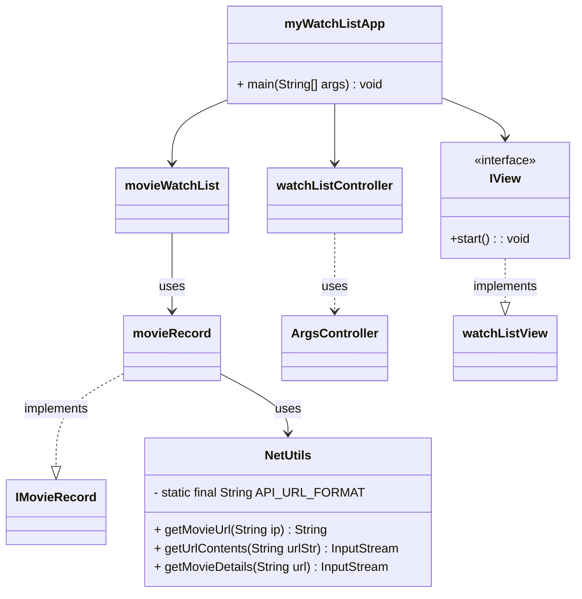

# Design Documents

You may have multiple design documents for this project. Place them all in this folder. File naming is up to you, but it should be clear what the document is about. At the bare minimum, you will want a pre/post UML diagram for the project. 


# Preliminary Diagram



# Final Design 

```mermaid 
classDiagram 

    class Main {
        + main(String [] args) : void 
    }

    class MovieModel {
    - movieList: MovieList
    - watchList: WatchList
    - sortFilter: ISortandFilter
    - records: List~MRecord~
    - databasePath: String
    + MovieModel()
    + MovieModel(String)
    + getRecord(String): MRecord 
    + getWatchList(): List~MRecord~
    + getRecordFromWatchList(String): MRecord
    + removeFromWatchList(MRecord): void
    + loadWatchListFromFile(): void
    + loadWatchListFromFile(String): void
    + addToWatchList(MRecord): void
    + addToWatchList(String): void
    + filterWatchList(String, String): Stream~MRecord~
    + sortMovieList(Stream~MRecord~, String, String): List~MRecord~
    + getRecords(): List~MRecord~
    + ApiKeySetter(String): void
    + saveWatchListToFile(): void
    + saveWatchListToFilepath(String, List~MRecord~): void
    + setMovieRating(String, String): void
    + addFromRecordsToWatchList(String): void
    + addRecord(MRecord): void
    + getMovieDistributions(): List~Double~
    }

    class IMovieModel {
        <<interface>>
        + String DATABASE = "data/movie.json"
        + String WATCHLIST_DATABASE = "data/myWatchList.json"
        + getRecord(String): MRecord
        + getRecords(): List~MRecord~ 
        + static writeRecords(Collection~MRecord~, OutputStream): void
        + ApiKeySetter(String): void
        + static getInstance(): IMovieModel
        + static getInstance(String): IMovieModel
        + getRecordFromWatchList(String): MRecord
        + addFromRecordsToWatchList(String): void
        + removeFromWatchList(MRecord): void
        + sortMovieList(Stream~MRecord~, String, String): List~MRecord~
        + saveWatchListToFile(): void
        + saveWatchListToFilepath(String, List~MRecord~): void
        + setMovieRating(String, String): void
        + filterWatchList(String, String): Stream~MRecord~
        + getWatchList(): List~MRecord~
        + loadWatchListFromFile(String): void
        + loadWatchListFromFile(): void
    }

    class WatchList {
        - watchList: List~MRecord~
        - movieList: MovieList
        + WatchList(MovieList)
        + addToWatchList(MRecord): void
        + removeFromWatchList(MRecord): void
        + getWatchList(): List~MRecord~
        + addFromRecordsToWatchList(String): void
        - getRecord(String): MRecord
        + getRecordFromWatchList(String): MRecord
        + setMovieRating(String, String): void
    }

    class MovieList {
        - records: List~MRecord~
        - databasePath: String
        + MovieList()
        + MovieList(String)
        + addRecord(MRecord): void
        + getRecord(String): MRecord
        + getRecords(): List~MRecord~
        + getDatabasePath(): String
    }

    class ISortandFilter {
        <<interface>>
        + sortMovieList(Stream~MRecord~, String, String): List~MRecord~
        + filterWatchList(String, String, List~MRecord~): Stream~MRecord~
    }

    class MovieListSortFilter {
        - multiYearParse(String): String
        + filterWatchList(String, String, List~MRecord~): Stream~MRecord~
        + sortMovieList(Stream~MRecord~, String, String): List~MRecord~
    }

    class MovieData {
        <<utility>>
        + static writeRecords(Collection~MRecord~, OutputStream): void
        + static loadFromDatabase(String, MovieList): void
        + static saveToDatabase(MovieList): void
        - static saveToDatabase(String, List~MRecord~): void
        + static saveWatchListToFile(WatchList): void
        + static saveWatchListToFilepath(String, WatchList): void
        + static loadWatchListFromFile(WatchList): void
    }

    class MRecord {
        <<record>>
        + Title: String
        + Year: String
        + Director: String
        + Actors: String
        + Plot: String
        + Poster: String
        + imdbRating: String
        + Genre: String
        + Runtime: String
        + Country: String
        + Response: String
    }

    class MyMovieList {
        - IMovieController controller 
        - JTable movieTable
        - DefaultTableModel tableModel
        - JButton loadButton
        - JButton addToWatchListButton
        - JButton removeFromWatchListButton
        - JButton saveOutButton
        - JButton viewGraph
        - JButton sortButton
        - JButton clearButton
        - JButton filterButton 
        - JButton searchButton
        - JButton submitApiKeyButton
        - JComboBox~String~ sortColumnCombo
        - JComboBox~String~ sortOrderCombo
        - JComboBox~String~ filterFieldCombo 
        - JTextField searchField
        - JTextField filterInput
        - JTextField apiKeyField
        - JList~String~ watchListDisplay
        - DefaultListModel~String~ watchlistModel
        - JPanel bottomPanel

        + MyMovieList()
        + setController(IMovieController): void 
        - initUI(): void
        - refreshMovieTable(): void
        - loadMovies(): void 
        - addSelectedMovieToWatchList(): void
        - removeSelectedMovieFromWatchList(): void 
        - sortMovieList(): void
        - clearTable(): void 
        - updateWatchlistPanel(): void
        - saveOut(): void
        - showGraph(): void
    }

    class MockMovieFeatures {
        + searchMovie(String): void
        + addToWatchList(String): void
        + getWatchList(): List~IMovieModel.MRecord~
        + modelSetAPIKey(String): void
        + getAllMovies(): List~IMovieModel.MRecord~
        + removeFromWatchList(String): void
        + sortMovieList(String, String): List~IMovieModel.MRecord~
        + saveWatchList(): void
        + setMyRating(String, String): void 
        + getMyRating(String): String
        + filterMovieList(String, String): List~IMovieModel.MRecord~
    }

    class GraphView {
        + GraphView(IMovieController)
        + main(String[]): void
    }

    class Controller {
        - IMovieModel model
        + Controller(IMovieModel)
        + loadWatchlistOnStartup(): void
        + searchMovie(String): void
        + addToWatchList(String): void
        + removeFromWatchList(String): void
        + getWatchList(): List~IMovieModel.MRecord~
        + getAllMovies(): List~IMovieModel.MRecord~
        + sortMovieList(String, String): List~IMovieModel.MRecord~
        + saveWatchList(): void
        + setMyRating(String, String): void
        + modelSetAPIKey(String): void
        + getMyRating(String): String
        + filterMovieList(String, String): List~IMovieModel.MRecord~
    }

    class IController {
        <<interface>>
        - IMovieModel model
        + IController(IMovieModel)
        + start(): void
        + printMovies(): void
        + lookupMovie(): void
        + lookupWatchlist(): void
        + sortMovieList(): void
        + filterMovieList(): void
        + addMovieToMovieList(): void
        + removeMovieFromMovieList(): void
    }

    class IMovieController {
        <<interface>>
        + searchMovie(String): void
        + addToWatchList(String): void
        + removeFromWatchList(string): void
        + saveWatchList(): void
        + getWatchList(): List~IMovieModel.MRecord~
        + getAllMovies(): List~IMovieModel.MRecord~
        + sortMovieList(String, String): List~IMovieModel.MRecord~
        + setMyRating(String, String): void
        + getMyRating(String): String
        + filterMovieList(String, String): List~IMovieModel.MRecord~
        + modelSetAPIKey(String): void
    }

    class NetUtils {
        - static final String API_URL_FORMAT: String
        - static API_KEY: String
        - NetUtils()
        + setAPIKey(String): void
        + getMovieUrl(String): String
        + getUrlContents(String): InputStream
        + getMovieDetails(String): InputStream
        + main(String[]): void
    }

    MovieModel ..|> IMovieModel
    MovieListSortFilter ..|> ISortandFilter
    MovieModel --> MovieList
    MovieModel --> WatchList
    MovieModel --> ISortandFilter
    WatchList --> MovieList
    Controller ..|> IMovieController
    Controller --> IMovieModel
    MyMovieList --> IMovieController
    GraphView --> IMovieController
    MockMovieFeatures --> IMovieModel
    Main --> MyMovieList
    MovieModel --> MRecord
    MyMovieList --> JTable
    MyMovieList --> DefaultTableModel
    MyMovieList --> JButton
    MyMovieList --> JComboBox~String~
    MyMovieList --> JTextField
    MyMovieList --> JList~String~
    MyMovieList --> DefaultListModel~String~
    MyMovieList --> JPanel
    NetUtils --> MRecord

    ```