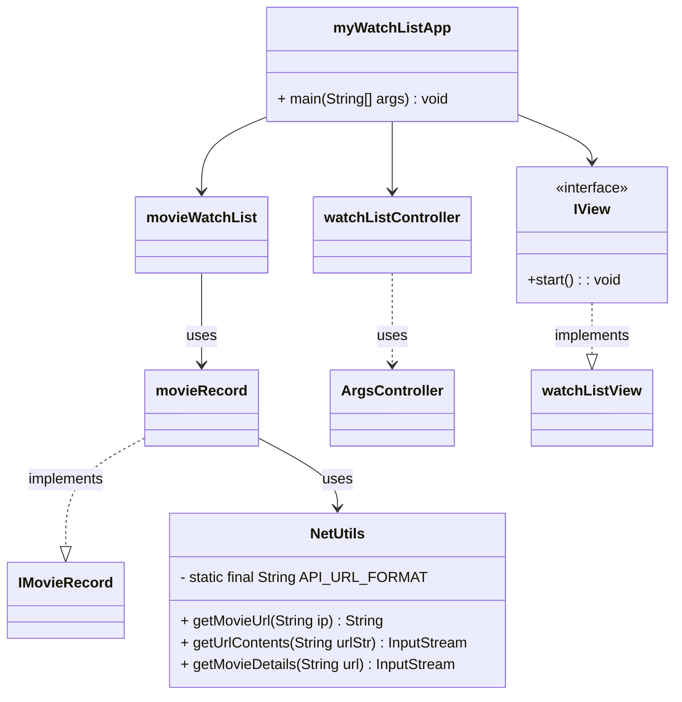

# Design Documents

You may have multiple design documents for this project. Place them all in this folder. File naming is up to you, but it should be clear what the document is about. At the bare minimum, you will want a pre/post UML diagram for the project. 


# Preliminary Diagram



# Final Design 

```mermaid 
classDiagram 

    class Main {
        + main(String [] args) : void 
    }

    class MovieModel{
        - records: List~MRecord~
        - watchList: List~MRecord~
        - databasePath: String
        + MovieModel()
        + MovieModel(String)
        + addRecord(MRecord): Void 
        + getRecord(String): MRecord 
        + ApiKeySetter(String): void 
        + addToWatchList(MRecord): void
        + removeFromWatchList(MRecord): void 
        + getWatchList() : List~MRecord~
        + addFromRecordsToWatchList(String): void 
        + saveWatchListToFile(): void
        + loadWatchListFromFile(): void
        + setMovieRating(String, String): void 
        + getRecordFromWatchList(String): MRecord 
        + filterWatchList (String, String): Stream~MRecord~
        - loadFromDatabase(String): void 
        - saveToDatabase(): void
        - saveToDatabase(String): void
    }