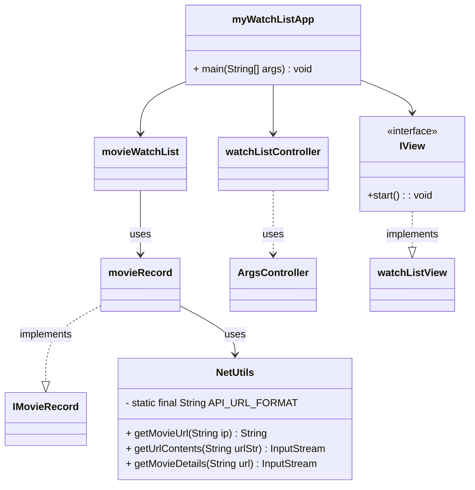

# Design Documents

You may have multiple design documents for this project. Place them all in this folder. File naming is up to you, but it should be clear what the document is about. At the bare minimum, you will want a pre/post UML diagram for the project. 


# Preliminary Diagram



# Final Design 

```mermaid 
classDiagram 

    class Main {
        + main(String [] args) : void 
    }

    class MovieModel {
        - records: List~MRecord~
        - watchList: List~MRecord~
        - databasePath: String
        + MovieModel()
        + MovieModel(String)
        + addRecord(MRecord): Void 
        + getRecord(String): MRecord 
        + ApiKeySetter(String): void 
        + addToWatchList(MRecord): void
        + removeFromWatchList(MRecord): void 
        + getWatchList() : List~MRecord~
        + addFromRecordsToWatchList(String): void 
        + saveWatchListToFile(): void
        + loadWatchListFromFile(): void
        + setMovieRating(String, String): void 
        + getRecordFromWatchList(String): MRecord 
        + filterWatchList (String, String): Stream~MRecord~
        - loadFromDatabase(String): void 
        - saveToDatabase(): void
        - saveToDatabase(String): void
    }

    class IMovieModel {
        <<interface>>
        + String DATABASE = "data/movie.json"
        + String WATCHLIST_DATABASE = "data/myWatchList.json"
        + getRecords(): List~MRecord~ 
        + getRecords(String): MRecord
        + static writeRecords(Collection~MRecord~, OutputStream): void
        + loadWatchListFromFile(): void 
        + setMovieRating(String, String): void 
        + sortMovieList(Stream~MRecord~, String, String): List~MRecord~
        + filterWatchList(String, String): Stream~MRecord~
        + saveWatchListToFile(): void
        + getWatchList(): List~MRecord~
        + getRecordFromWatchList(String): MRecord
        + removeFromWatchList(MRecord): void
        + ApiKeySetter(String): void
        + addFromRecordsToWatchList(String): void
        + static exportRecordAsJson(MRecord): String
        + static getInstance(): IMovieModel
        + static getInstance(String): IMovieModel
    }

    class MyMovieList {
        - IMovieController controller 
        - JTable movieTable
        - DefaultTableModel tableModel
        - JButton loadButton
        - JButton addToWatchListButton
        - JButton removeFromWatchListButton
        - JButton saveOutButton
        - JButton viewGraph
        - JButton sortButton
        - JButton clearButton
        - JButton filterButton 
        - JButton searchButton
        - JButton submitApiKeyButton
        - JComboBox~String~ sortColumnCombo
        - JComboBox~String~ sortOrderCombo
        - JComboBox~String~ filterFieldCombo 
        - JTextField searchField
        - JTextField filterInput
        - JTextField apiKeyField
        - JList~String~ watchListDisplay
        - DefaultListModel~String~ watchlistModel
        - JPanel bottomPanel

        + MyMovieList()
        + setController(controller): void 
        - initUI(): void
        - refreshMovieTable(): void
        - loadMovies(): void 
        - addSelectedMovieToWatchList(): void
        - removeSelectedMovieFromWatchList(): void 
        - sortMovieList(): void
        - clearTable(): void 
        - updateWatchlistPanel(): void
        - saveOut(): void
        - showGraph(): void
    }

    class MockMovieFeatures {
        + searchMovie(String): void
        + addToWatchList(String): void
        + getWatchList(): List~IMovieModel.MRecord~
        + modelSetAPIKey(String): void
        + getAllMovies(): List~IMovieModel.MRecord~
        + removeFromWatchList(String): void
        + sortMovieList(String, String): List~IMovieModel.MRecord~
        + saveWatchList(): void
        + setMyRating(String, String): void 
        + getMyRating(String): String
        + filterMovieList(String, String): List~IMovieModel.MRecord~
    }