# Manual 

Welcome to the MyMovieList application. This manual will show you how to interact with the program, and use it's features, which include sorting a list, filtering a list, and changing ratings.

# API Key
To get started, enter your email at the link below, and follow the instructions to obtain a free API key.

## [API Key Link](https://www.omdbapi.com/apikey.aspx)

When you first start the application, enter your API key in the field in the top left hand corner of the window, and click submit. If you do not enter an API Key, you will be unable to add new movies to the list, but will still be able to use other features and the provided list of movies.

# Managing your Watchlist

### Searching a movie
Once you have added a key, try adding a movie of your choosing by entering a movie in the field titled "search". Searches do not need to be exact, but if you are more specific you will yield better results.

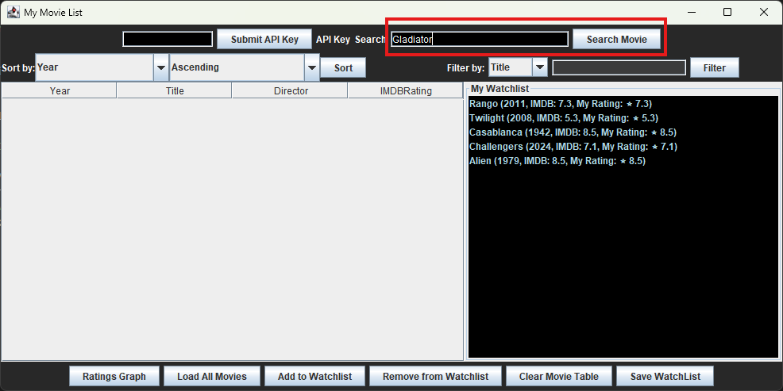

### Adding it to your Watchlist

To add the movie to your watchlist left click the movie from the main list, and then click "Add to Watchlist". Once you click "OK" in the message that appears, your movie should now show in the My Watchlist pane!

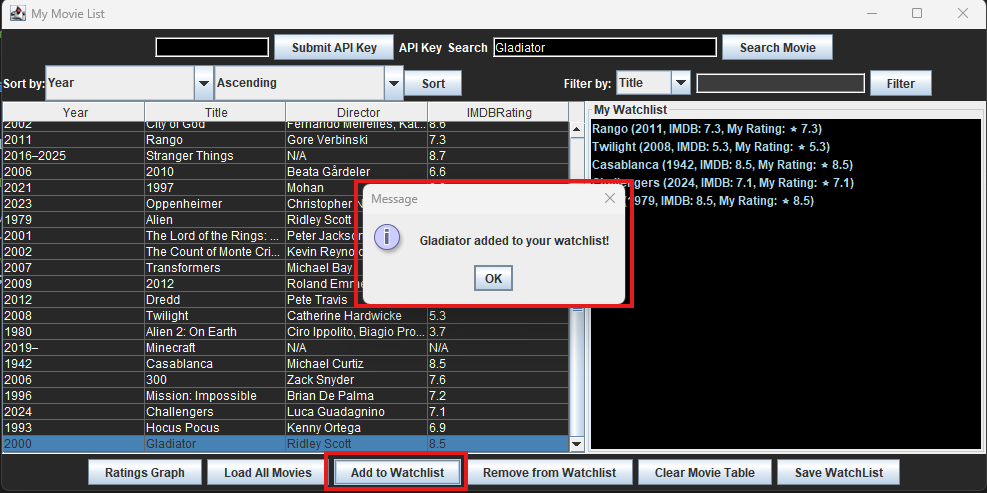

### Entering a custom rating

To enter a rating for a movie, right click on the movie in the My Watchlist field, and enter a rating in the window that appears. Ratings must be within the range of 1-10. Please note, that this will only update your personal rating, and not the ratings that are provided by IMDB.

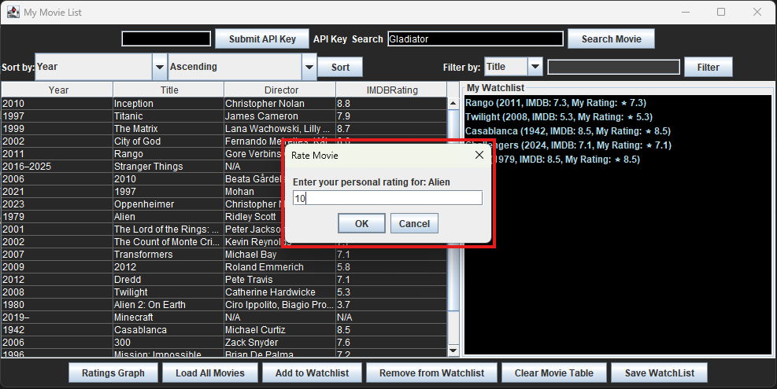

Your rating will now be updated!

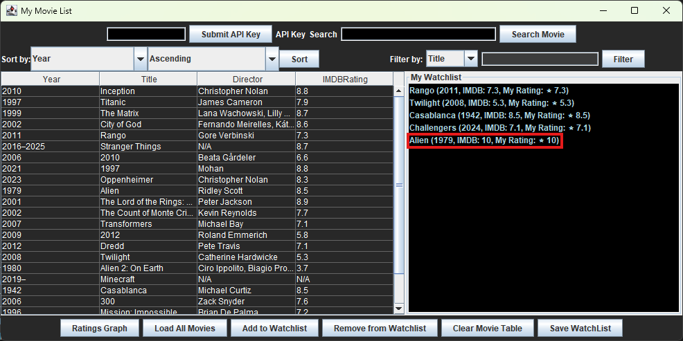

### Removing a movie

If you ever change your mind and decide you no longer want to watch a particular movie, you can remove it from your Watchlist by left clicking on the movie, and then selecting "Remove from Watchlist". Keep in mind, that if your remove a movie from your watchlist, any rating data will also be lost.

On success you will receive a message letting you know which movie has been removed, and once you click OK, the movie will be removed.

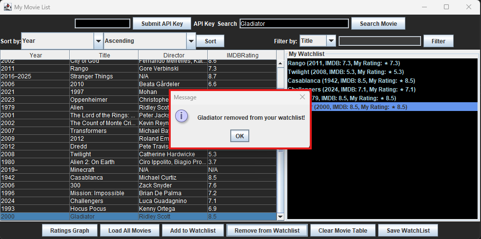

# Sorting and Filtering the List

In order to make managing your watchlist and finding movies easier, you can also sort or filter the provided list of movies, or any movies you add to this list.

### Sorting

To sort the movies, choose one of the four options from the dropdown titled "Sort by". The options include year, title, director, and rating. You can choose to display these options in either ascending or descending order. Once you have selected an option and order, click the "Sort" button to update the list.

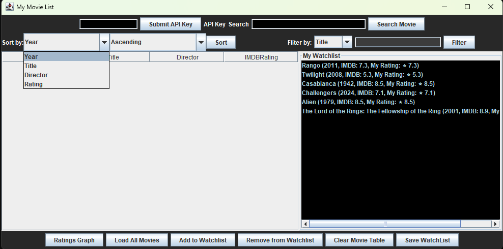

The example below shows the default list of movies successfully sorted in ascending order.

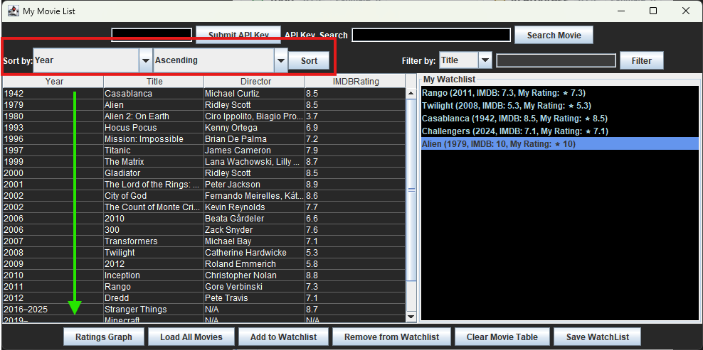

### Filtering

You can also use the filter options in the top right hand corner to filter the list of movies. These options include year, title, director, genre, actors, rating, runtime and country. Please note, that sorts and filters are not progressive.

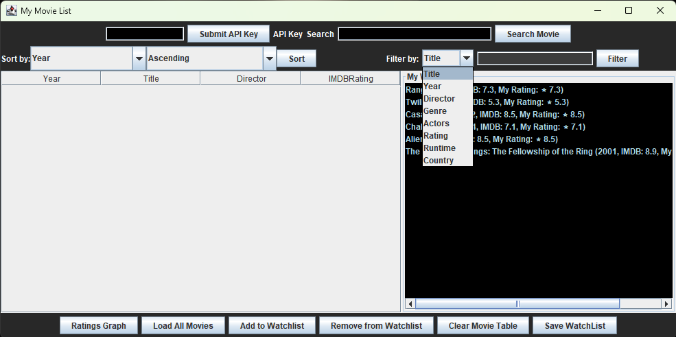

The example below shows filtering only the movies which have the actor "Keanu Reeves" in the cast. As shown below, the names do not need to be full names, but more specific names and correct spelling will yield better results.

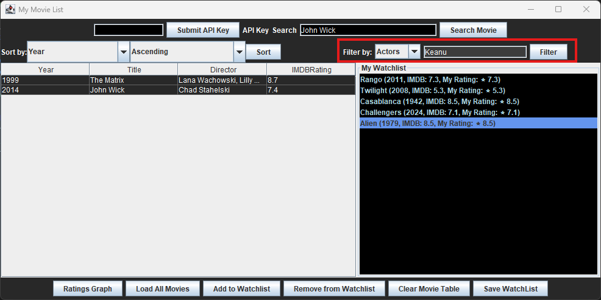

### Clearing your search

If you wish to start fresh, you can clear the movie table by clicking the "Clear Movie Table" button. 

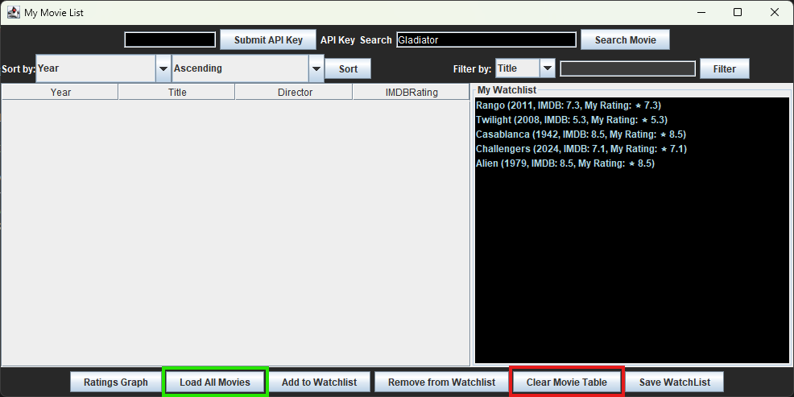

Then, you can repopulate the original list of movies (including any you may have searched) by clicking the "Load All Movies" button. 

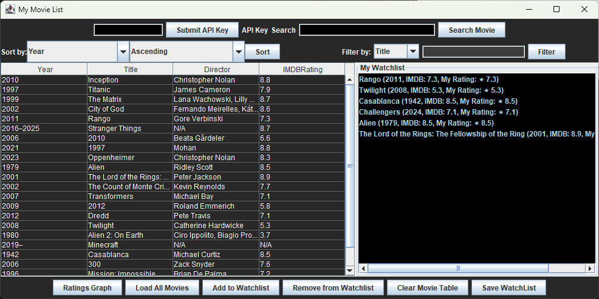

# Saving your Watchlist

### Saving

To save your watchlist, click the "Save Watchlist" button in the bottom right hand corner.

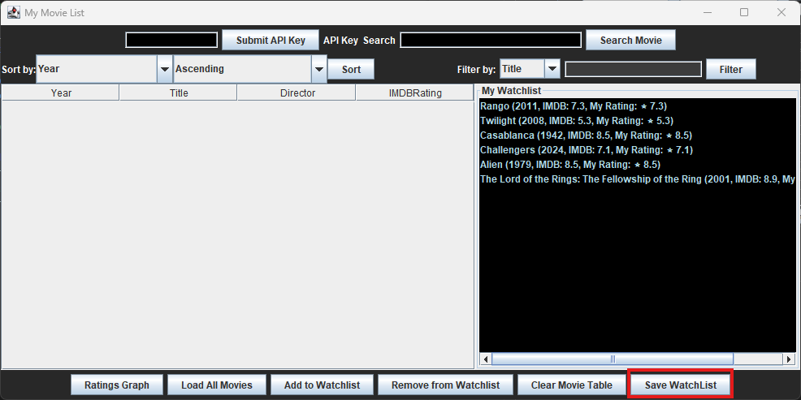

Once you click this button, a window will appear which allows you to select a destination and name for your Watchlist.

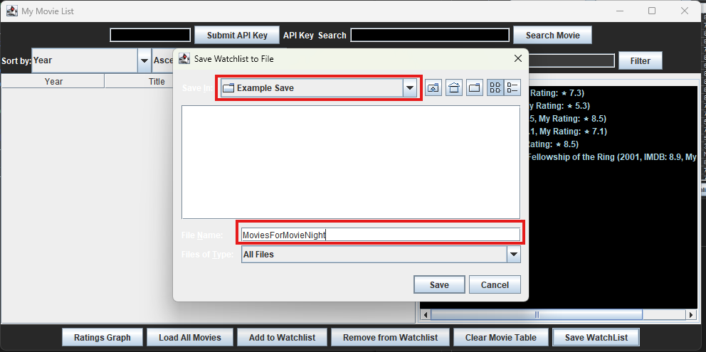

For ease of use, your Watchlist, and the database of movies are also saved locally and persist throughout sessions, so if you forget to save a list, you can still access it by restarting the program. 

### Work In Progress: Graph of Ratings

To get a visual distribution of the ratings you have added, you can click the "Ratings Graph" button. 

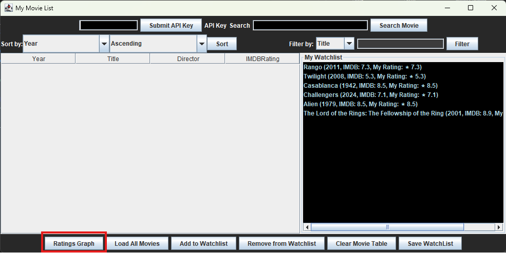

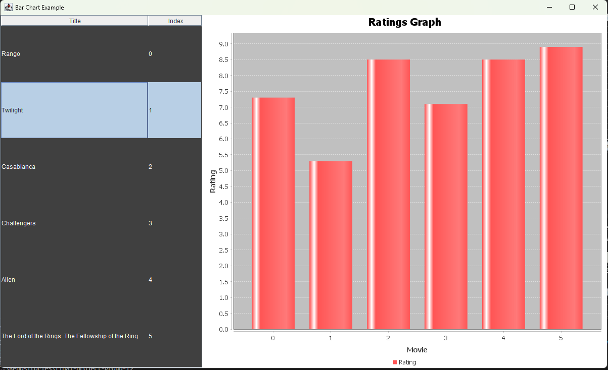

# Thank you!

### Thank you for trying out our MyMovieList application, and we hope you have a fun movie night! 🎥🎥🎥
